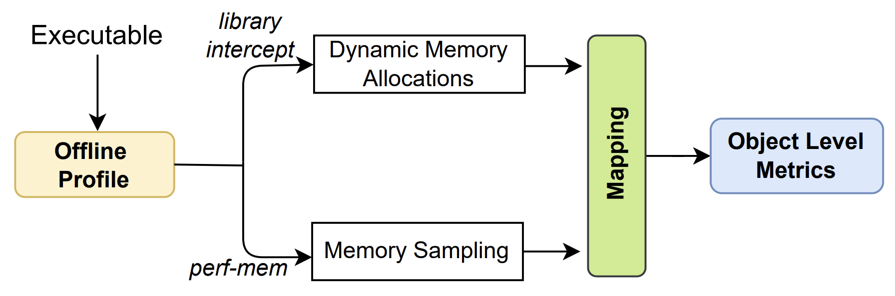

# Performance Characterization of AutoNUMA Memory Tiering on Graph Analytics #

This document contains instructions and codes for reproducing experimental results presented in "Performance Characterization of AutoNUMA Memory Tiering on Graph Analytics". This paper was accepted for publication at 2022 IEEE International Symposium on Workload Characterization (IISWC 2022). To run these artifacts, a machine with Intel Optane is required.


## Overview

<p align="center">
<a href="design.pdf" class="image fit"></a>
</p>

The execution of the experiments is divided into three major phases:

* **Data collection**
  * In this phase, dynamic memory allocations and memory access samples of the monitored application are collected.
  * This data is collected through the ***run.sh*** script.
* **Post Process**
  * In this phase we postprocess the generated data (perf.data). This is because perf-script does not generate the data necessary for our analysis in its default mode. At the end, we will have a file formatted and ready for the next phase.
  * This second step is performed by executing the ***post_process.sh*** script.
* **Mapping**
  * With the formatted data we carry out the mapping phase. In this phase we try to map each memory sample to its respective allocation using memory address and timestamp information.
  * This step is accomplished by running a python program called ***mapping.py***.
 
After that we used shell scripts and python script to generate graphs and extract the results.

## Requirements

* **CPU support** 
  * We use Intel(R) Xeon(R) Gold 6240 CPU, but any other CPU supporting Intel Optane is suitable to perform the experiment. Also, intel optane memory is required.
* **Linux support**
  * The kernel must be greater than or equal to kernel 5.1. From that version the kernel brings support for the volatile-use of persistent memory as a hotplugged memory region (KMEM DAX). When this feature is enabled, persistent memory is seen as a separate memory-only NUMA node(s). The kernel must also support autonuma memory tiering.
* **Utilities**
  * We use the [syscall-intercept](https://github.com/pmem/syscall_intercept) library responsible for intercepting memory allocations in user space. We also use [ipmctl](https://github.com/intel/ipmctl/releases) and [ndctl](https://github.com/pmem/ndctl) to configure intel optane and instantiate as numa node.

## Installation

We ran our experiments on a single socket of a dual socket Intel Cascade Lake. The commands below configure the Intel Optane as App Direct Mode on a single socket and then instantiate as on a node.
```console
[root@optane]# ndctl destroy-namespace -f all
[root@optane]# ipmctl create -f -goal -socket 0 PersistentMemoryType=AppDirect
[root@optane]# ndctl create-namespace --region=region0 -m devdax --map=mem
[root@optane]# daxctl reconfigure-device dax0.0 --mode=system-ram
```


Then you must clone and build the kernel with autonuma support from the following repository:
```console
[dmoura@optane]$ git clone git://git.kernel.org/pub/scm/linux/kernel/git/vishal/tiering.git
[dmoura@optane]$ git checkout origin/tiering-0.8
```
We compiled the latest version (tiering-0.8) at the time.

We changed the permission of perf to collect the samples:

```console
[dmoura@optane]$ sudo sh -c 'echo 0 >/proc/sys/kernel/perf_event_paranoid'
```

We must clone the library to intercept the allocations and follow the steps contained in the repository for the installation.
```console
[dmoura@optane]$ git clone https://github.com/pmem/syscall_intercept.git
```

We should also clone the repository for the workloads (applications + datasets) and follow the steps for compiling and generating the datasets:
```console
[dmoura@optane]$ git clone https://github.com/sbeamer/gapbs.git
```

The urand and kron datasets were generated using the following parameters, totaling approximately 208GB and 259GB respectively.
```console
[dmoura@optane gapbs]$ ./converter -g30 -k16 -b kron.sg
[dmoura@optane gapbs]$ ./converter -u31 -k16 -b urand.sg
```

## Experiment Workflow

Before starting it is necessary to inform where the gapbs applications were installed. For that, you must configure the environment variable GAPBS_PATH according to the command below, modifying only the path.

```console
[dmoura@optane]$ export GAPBS_PATH="/scratch/gapbs"
```

Then the first script to run will collect memory samples and trace allocations from the application to be monitored. For this we will enter the collect_scripts folder and run the following command:

```console
[dmoura@optane collect_scripts]$ sudo ./start_run.sh
```

The start_run.sh script will generate three files for each workload: allocations.csv, track_info.csv and perf.data.

After completing the previous step, we will post process the generated results using the following command:
```console
[dmoura@optane collect_scripts]$ sudo ./start_post_process.sh
```

Then we run the script to perform the mapping using the following command:
```console
[dmoura@optane collect_scripts]$ ./start_mapping.sh
```

Finally we generate some input data and then create the graphs.
```console
[dmoura@optane plot_scripts]$ ./generate_inputs_to_plot.sh
[dmoura@optane plot_scripts]$ ./start_plots.sh
```

